# OpenMinis-to-Freehand UI Foundation Migration Tree

## Status

- status: `migration_in_progress`
- machine manifest:
  `docs/migrations/openminis-ui/ui-tree.manifest.json`
- SOP: `docs/migrations/openminis-ui/function-map-sop.md`
- target product tree: `docs/design/mobile-webui-ui-tree.md`
- browser: explicitly excluded
- architecture gate: `cargo run -p xtask -- gates check`

This tree describes the complete non-browser UI migration scope. It describes
semantic parity and Freehand target ownership, not visual parity.
Node status in the tables below mirrors the machine manifest. Only nodes whose
owner, operation, target symbol, and mapped gates are bound may advance beyond
`inventoried`; no `online_verified` claim is made without signed online evidence.

## Tree

```mermaid
flowchart TD
  Root[foundation.root / Freehand App Shell]
  SurfaceContract[foundation.surface_contract]
  ProtocolCalls[foundation.protocol_calls]
  SharedStates[foundation.shared_states]
  Home[home.dashboard]
  Session[session_detail.root]
  Header[session_detail.header]
  Transcript[session_detail.transcript]
  Composer[session_detail.composer]
  AgentSheet[session_detail.agent_sheet]
  ComposerText[composer.text_submit]
  ComposerAttachments[composer.attachments]
  ComposerQueue[composer.queue]
  ComposerStop[composer.stop_continue]
  ComposerVoice[composer.voice]
  UserBlock[turn_blocks.user]
  AssistantBlock[turn_blocks.assistant]
  ReasoningBlock[turn_blocks.reasoning]
  ToolBlock[turn_blocks.tool_activity]
  AttachmentBlock[turn_blocks.attachment]
  ArtifactBlock[turn_blocks.artifact]
  ErrorBlock[turn_blocks.error]
  Tools[tools.registry]
  ToolDetail[tools.detail]
  ToolsActivity[tools.activity]
  ToolPermissions[tools.permissions]
  Settings[settings.root]
  Models[settings.models]
  Runtime[settings.agent_runtime]
  Connection[settings.connection]
  Observability[settings.observability]
  Appearance[settings.appearance]
  About[settings.about]
  Search[session_search.root]
  NewSession[new_session.root]
  Timer[timer.dashboard]
  Files[files_artifacts.root]
  Skills[skills.root]
  Memory[memory.root]
  Integrations[integrations.root]
  Android[platform.android_bridge]

  Root --> Home
  Root --> SurfaceContract
  Root --> ProtocolCalls
  Root --> SharedStates
  Root --> Session
  Root --> Tools
  Root --> Settings
  Root --> Search
  Root --> NewSession
  Root --> Timer
  Root --> Files
  Root --> Skills
  Root --> Memory
  Root --> Integrations
  Root --> Android
  Home --> Session
  Session --> Header
  Session --> Transcript
  Session --> Composer
  Session --> AgentSheet
  Composer --> ComposerText
  Composer --> ComposerAttachments
  Composer --> ComposerQueue
  Composer --> ComposerStop
  Composer --> ComposerVoice
  Transcript --> UserBlock
  Transcript --> AssistantBlock
  Transcript --> ReasoningBlock
  Transcript --> ToolBlock
  Transcript --> AttachmentBlock
  Transcript --> ArtifactBlock
  Transcript --> ErrorBlock
  Tools --> ToolDetail
  Tools --> ToolsActivity
  Tools --> ToolPermissions
  Settings --> Models
  Settings --> Runtime
  Settings --> Connection
  Settings --> Observability
  Settings --> Appearance
  Settings --> About
  Search --> Session
  NewSession --> Session
```



## Entrypoint And Registered Paths

- entrypoint_node_id: `foundation.root`

### Forward Edges

| edge_id | from_node_id | to_node_id | semantic |
| --- | --- | --- | --- |
| `ui_tree.foundation.root.to.home.dashboard` | `foundation.root` | `home.dashboard` | `contains_or_navigates_to` |
| `ui_tree.foundation.root.to.session_detail.root` | `foundation.root` | `session_detail.root` | `contains_or_navigates_to` |
| `ui_tree.foundation.root.to.tools.registry` | `foundation.root` | `tools.registry` | `contains_or_navigates_to` |
| `ui_tree.foundation.root.to.settings.root` | `foundation.root` | `settings.root` | `contains_or_navigates_to` |
| `ui_tree.foundation.root.to.session_search.root` | `foundation.root` | `session_search.root` | `contains_or_navigates_to` |
| `ui_tree.foundation.root.to.new_session.root` | `foundation.root` | `new_session.root` | `contains_or_navigates_to` |
| `ui_tree.foundation.root.to.timer.dashboard` | `foundation.root` | `timer.dashboard` | `contains_or_navigates_to` |
| `ui_tree.foundation.root.to.files_artifacts.root` | `foundation.root` | `files_artifacts.root` | `contains_or_navigates_to` |
| `ui_tree.foundation.root.to.skills.root` | `foundation.root` | `skills.root` | `contains_or_navigates_to` |
| `ui_tree.foundation.root.to.memory.root` | `foundation.root` | `memory.root` | `contains_or_navigates_to` |
| `ui_tree.foundation.root.to.integrations.root` | `foundation.root` | `integrations.root` | `contains_or_navigates_to` |
| `ui_tree.foundation.root.to.platform.android_bridge` | `foundation.root` | `platform.android_bridge` | `contains_or_navigates_to` |
| `ui_tree.home.dashboard.to.session_detail.root` | `home.dashboard` | `session_detail.root` | `contains_or_navigates_to` |
| `ui_tree.session_detail.root.to.session_detail.header` | `session_detail.root` | `session_detail.header` | `contains_or_navigates_to` |
| `ui_tree.session_detail.root.to.session_detail.transcript` | `session_detail.root` | `session_detail.transcript` | `contains_or_navigates_to` |
| `ui_tree.session_detail.root.to.session_detail.composer` | `session_detail.root` | `session_detail.composer` | `contains_or_navigates_to` |
| `ui_tree.session_detail.root.to.session_detail.agent_sheet` | `session_detail.root` | `session_detail.agent_sheet` | `contains_or_navigates_to` |
| `ui_tree.session_detail.transcript.to.turn_blocks.user` | `session_detail.transcript` | `turn_blocks.user` | `contains_or_navigates_to` |
| `ui_tree.session_detail.transcript.to.turn_blocks.assistant` | `session_detail.transcript` | `turn_blocks.assistant` | `contains_or_navigates_to` |
| `ui_tree.session_detail.transcript.to.turn_blocks.reasoning` | `session_detail.transcript` | `turn_blocks.reasoning` | `contains_or_navigates_to` |
| `ui_tree.session_detail.transcript.to.turn_blocks.tool_activity` | `session_detail.transcript` | `turn_blocks.tool_activity` | `contains_or_navigates_to` |
| `ui_tree.session_detail.transcript.to.turn_blocks.attachment` | `session_detail.transcript` | `turn_blocks.attachment` | `contains_or_navigates_to` |
| `ui_tree.session_detail.transcript.to.turn_blocks.artifact` | `session_detail.transcript` | `turn_blocks.artifact` | `contains_or_navigates_to` |
| `ui_tree.session_detail.transcript.to.turn_blocks.error` | `session_detail.transcript` | `turn_blocks.error` | `contains_or_navigates_to` |
| `ui_tree.tools.registry.to.tools.detail` | `tools.registry` | `tools.detail` | `contains_or_navigates_to` |
| `ui_tree.settings.root.to.settings.models` | `settings.root` | `settings.models` | `contains_or_navigates_to` |
| `ui_tree.settings.root.to.settings.agent_runtime` | `settings.root` | `settings.agent_runtime` | `contains_or_navigates_to` |
| `ui_tree.settings.root.to.settings.connection` | `settings.root` | `settings.connection` | `contains_or_navigates_to` |
| `ui_tree.settings.root.to.settings.observability` | `settings.root` | `settings.observability` | `contains_or_navigates_to` |
| `ui_tree.settings.root.to.settings.appearance` | `settings.root` | `settings.appearance` | `contains_or_navigates_to` |
| `ui_tree.settings.root.to.settings.about` | `settings.root` | `settings.about` | `contains_or_navigates_to` |
| `ui_tree.session_search.root.to.session_detail.root` | `session_search.root` | `session_detail.root` | `contains_or_navigates_to` |
| `ui_tree.new_session.root.to.session_detail.root` | `new_session.root` | `session_detail.root` | `contains_or_navigates_to` |
| `ui_tree.foundation.root.to.foundation.surface_contract` | `foundation.root` | `foundation.surface_contract` | `contains_or_navigates_to` |
| `ui_tree.foundation.root.to.foundation.protocol_calls` | `foundation.root` | `foundation.protocol_calls` | `contains_or_navigates_to` |
| `ui_tree.foundation.root.to.foundation.shared_states` | `foundation.root` | `foundation.shared_states` | `contains_or_navigates_to` |
| `ui_tree.session_detail.composer.to.composer.text_submit` | `session_detail.composer` | `composer.text_submit` | `contains_or_navigates_to` |
| `ui_tree.session_detail.composer.to.composer.attachments` | `session_detail.composer` | `composer.attachments` | `contains_or_navigates_to` |
| `ui_tree.session_detail.composer.to.composer.queue` | `session_detail.composer` | `composer.queue` | `contains_or_navigates_to` |
| `ui_tree.session_detail.composer.to.composer.stop_continue` | `session_detail.composer` | `composer.stop_continue` | `contains_or_navigates_to` |
| `ui_tree.session_detail.composer.to.composer.voice` | `session_detail.composer` | `composer.voice` | `contains_or_navigates_to` |
| `ui_tree.tools.registry.to.tools.activity` | `tools.registry` | `tools.activity` | `contains_or_navigates_to` |
| `ui_tree.tools.registry.to.tools.permissions` | `tools.registry` | `tools.permissions` | `contains_or_navigates_to` |

### Return Paths

| from_node_id | to_node_id | semantic |
| --- | --- | --- |
| `session_detail.root` | `foundation.root` | `route_back_to_app_shell` |
| `tools.registry` | `foundation.root` | `route_back_to_app_shell` |
| `settings.root` | `foundation.root` | `route_back_to_app_shell` |
| `session_search.root` | `foundation.root` | `route_back_to_app_shell` |
| `new_session.root` | `foundation.root` | `route_back_to_app_shell` |
| `timer.dashboard` | `foundation.root` | `route_back_to_app_shell` |
| `files_artifacts.root` | `foundation.root` | `route_back_to_app_shell` |
| `skills.root` | `foundation.root` | `route_back_to_app_shell` |
| `memory.root` | `foundation.root` | `route_back_to_app_shell` |
| `integrations.root` | `foundation.root` | `route_back_to_app_shell` |

## Migration Layers

```text
Layer 0  Resource owners
Layer 1  ui.protocol projections, queries, commands, receipts, errors
Layer 2  App shell, ADP client, route controller, edge registry
Layer 3  Surface index/controller
Layer 4  Surface model
Layer 5  View and reusable semantic blocks
Layer 6  Controls
Layer 7  Android platform bridge
```

## Node Groups

### Foundation

| Node | Source reference | Freehand target | Initial status |
| --- | --- | --- | --- |
| `foundation.root` | `Views/ContentView.swift` | app shell, route controller, edge registry | `source_bound` |
| `foundation.surface_contract` | OpenMinis view hierarchy as semantic input | `surfaces/*/{index,model,view,controls}` | `source_bound` |
| `foundation.protocol_calls` | OpenMinis local action wiring, semantics only | generated ADP command/query path | `inventoried` |
| `foundation.shared_states` | loading/empty/error/confirmation/sheet patterns | shared render contracts | `implementation_in_progress` |

### Home and session navigation

| Node | Source reference | Freehand target | Initial status |
| --- | --- | --- | --- |
| `home.dashboard` | `Views/ContentView.swift`, Chat store UI usage | `surfaces/home-dashboard` | `inventoried` |
| `session_detail.root` | `Views/Chat/AIChatView.swift` | `surfaces/session-detail` | `inventoried` |
| `session_detail.header` | `Views/Chat/AIChatView.swift` | SessionDetail identity, lifecycle, navigation, actions | `inventoried` |
| `session_detail.transcript` | `Views/Chat/AIChatView.swift` | chronological projection-only block composition | `inventoried` |
| `session_detail.composer` | `Views/Chat/AIChatView.swift` | session-bound draft and owner-command controls | `inventoried` |
| `session_search.root` | session navigation/search behavior | `surfaces/session-search` | `inventoried` |
| `new_session.root` | new-chat/session actions | `surfaces/new-session` | `inventoried` |
| `session_detail.agent_sheet` | session-scoped tool/agent detail patterns | SessionDetail scoped Agent sheet | `inventoried` |

### Transcript and turn blocks

| Node | Source reference | Required target semantic | Initial status |
| --- | --- | --- | --- |
| `turn_blocks.user` | `ChatMessageViews.swift` | chronological user row | `inventoried` |
| `turn_blocks.assistant` | `AssistantBlockView.swift` | assistant text/final rows | `inventoried` |
| `turn_blocks.reasoning` | `AssistantBlockView.swift` | nonterminal reasoning/model wait | `inventoried` |
| `turn_blocks.tool_activity` | `ToolLiveSheet.swift`, `ChatModels.swift` | waiting/running/completed/failed/cancelled tool rows | `inventoried` |
| `turn_blocks.attachment` | `Views/Chat/Media/*`, `ChatModels.swift` | metadata-only persisted attachment display | `inventoried` |
| `turn_blocks.artifact` | file/media preview semantics | typed artifact link/preview | `blocked_resource_missing` |
| `turn_blocks.error` | provider/tool/chat visible errors | typed visible failure block | `inventoried` |

### Composer

| Node | Source reference | Required target semantic | Initial status |
| --- | --- | --- | --- |
| `composer.text_submit` | `ChatInputBar.swift` | session-bound submit | `inventoried` |
| `composer.attachments` | `AIChatViewModel+Attachments.swift`, `ChatInputBar.swift` | transient draft + metadata persistence | `inventoried` |
| `composer.queue` | `ChatModels.swift::QueuedPrompt` | queued prompt projection/control | `blocked_owner_missing` |
| `composer.stop_continue` | chat cancellation/retry controls | owner-backed cancel/continue | `inventoried` |
| `composer.voice` | `Views/Chat/Voice/*` | deferred platform capability | `blocked_owner_missing` |

### Tools

| Node | Source reference | Required target semantic | Initial status |
| --- | --- | --- | --- |
| `tools.registry` | `AIChatViewModel+ToolDefinitions.swift` as source inventory only | owner-safe built-in registry | `inventoried` |
| `tools.detail` | OpenMinis tool detail/live presentation | schema/examples/guidance and lifecycle detail | `inventoried` |
| `tools.activity` | `ToolLiveSheet.swift`, assistant tool blocks | session-specific Tool Call/Result blocks | `inventoried` |
| `tools.permissions` | `OffloadPermissionDialog.swift` and permission settings | typed permission/confirmation model | `blocked_owner_missing` |

### Settings and basic configuration

| Node | OpenMinis source family | Freehand target | Initial status |
| --- | --- | --- | --- |
| `settings.root` | `Views/Settings/*`, `Views/ContentView.swift` | Settings stack | `inventoried` |
| `settings.models` | `Views/Providers/*` | provider list/detail, model selection/groups | `inventoried` |
| `settings.agent_runtime` | agent loop/background settings semantics | Worker/runtime owner projection | `inventoried` |
| `settings.connection` | network/offload/config semantics | daemon connection and Android bridge status | `inventoried` |
| `settings.observability` | logs/audit/storage diagnostic views | safe diagnostics projection | `inventoried` |
| `settings.appearance` | font/theme preferences | transient/persisted UI preference owner | `blocked_owner_missing` |
| `settings.about` | `AboutView.swift` | build/version/about | `inventoried` |

### Secondary resource surfaces

| Node | OpenMinis source family | Freehand target | Initial status |
| --- | --- | --- | --- |
| `timer.dashboard` | alarm/background activity views | owner-backed Timer dashboard | `inventoried` |
| `files_artifacts.root` | `FileBrowserView.swift`, media previews | files/artifacts list and preview | `blocked_resource_missing` |
| `skills.root` | `SkillsManagementView.swift`, `SessionSkillsView.swift` | capability/Skills registry and detail | `blocked_protocol_missing` |
| `memory.root` | `MemoryManagementView.swift`, `SessionMemoryView.swift` | Memory registry/session relation | `blocked_resource_missing` |
| `integrations.root` | `Views/MCP/*` | integration registry/config/status | `blocked_resource_missing` |

### Platform shell

| Node | Source reference | Freehand target | Initial status |
| --- | --- | --- | --- |
| `platform.android_bridge` | OpenMinis platform integrations as behavior references only | file picker, notification, download/open, back/keyboard/insets/update | `inventoried` |

## Shared State Contract

Owner-backed state:

```text
sessions
turns
tool activity
config
tasks
agents
timers
diagnostics
attachments metadata
```

Permitted transient UI state:

```text
current route
opened sheet/menu
selected filter
composer draft
attachment draft bytes
scroll intent
expanded block ids
pending command correlation
```

Pending command correlation is not success truth. Owner receipt and re-query
must close it.

## Explicitly Excluded Tree

```text
browser.*
cookie.*
browser_profile.*
browser_takeover.*
OpenMinis local Agent loop
OpenMinis ChatStore as a Freehand store
OpenMinis provider factory on Android/WebUI
SwiftUI layout/color/theme copying
```

## Migration Exit

The tree is complete only when all included non-deferred nodes are
`online_verified`, blocked nodes have real owners/contracts and then pass the
same state progression, and all corresponding legacy duplicate paths are
retired. Every retirement must use exactly one owner-feature mainline
`legacy_scan_roots` row whose paths and removed identity sets exactly match the
node lifecycle record and whose paths cover the node's bound targets and removed
paths; manifest-selected arbitrary scan roots are invalid. The machine manifest,
product UI tree, function maps, mainline call maps, and tests must agree.
