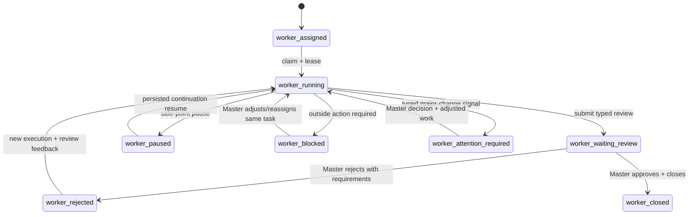
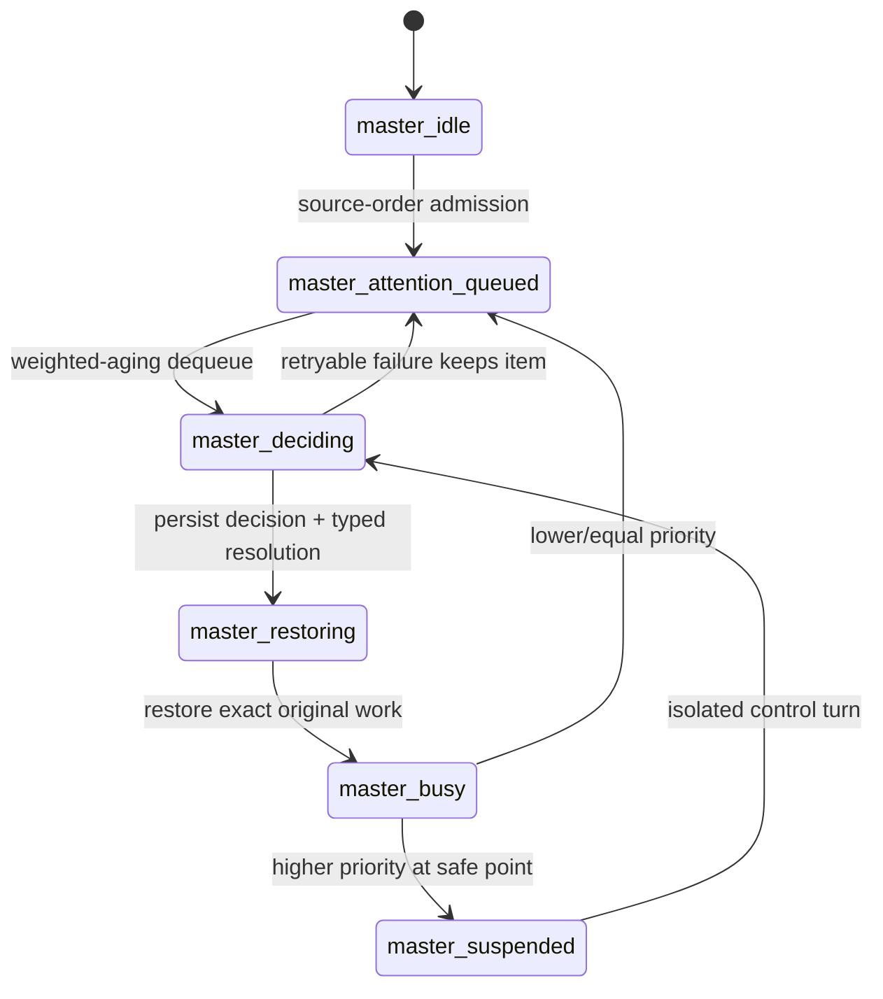

# Master / Worker Lifecycle Review

Canonical machine contract:
[`docs/lifecycles/master-worker-lifecycle.json`](../lifecycles/master-worker-lifecycle.json).

This review surface deliberately separates Worker closure, Master closure, and
their later integration. A multi-Worker end-to-end run cannot replace either
state-machine proof.

## Worker Lifecycle

The framework owns task, execution, lease, control, and event truth. The Worker
owns execution and submission. The Master owns review and task adjustment.

## Master Lifecycle

When Master is idle, EventInbox admission stays source ordered: the durable
cursor advances only after source events are represented in `pending_attention`
or classified as non-attention. Dequeue is a separate deterministic policy:
`severity * 10000 + clamp(task_priority,-100,100) * 100 + admission_age * 5000`.
Critical major-change attention, blocked showstoppers, and high-priority work
therefore carry large weight, while admission aging guarantees older low-priority
items eventually surface without wall-clock guessing. Retryable provider/model
failures keep the same pending item; stale no-op events are removed and the
runner continues selecting in the same tick.

When Master is busy, low-priority work still waits. Higher-priority attention may
interrupt only at a safe point after the exact active work identity is
checkpointed. The event uses a separate control turn. Resume injects only a
typed `AttentionResolution`; raw Worker/control/provider transcripts are
forbidden from the original user context.

## Current Binding Status

- Bound Worker edges: assignment/claim, review submission, rejection/reasoning
  retry, blocked truth, typed major-change attention, review approval/close,
  and interrupted reassign.
- Pending Worker edges: production safe-point pause/resume.
- Bound Master edges: source-ordered EventInbox admission into durable
  `pending_attention`, weighted-aging idle dequeue, retry-preserved attention
  identity, review/blocked/interrupted decisions, overall-goal evaluation
  turns, busy lower-priority deferral, active-work checkpointing, safe-point
  high-priority suspension state, typed attention resolution, and exact return
  identity, plus focused-test-bound injection of typed resolution into the
  original foreground reasoning continuation with stale tool/terminal
  invalidation.
- Pending Master edge: isolated-control-turn proof for a suspended active user
  turn remains pending. Until daemon/WebUI online evidence proves the full
  suspend → decision → typed continuation path, busy-Master live preemption is
  not product-closed.

## Integration Checklist

- Worker positive and negative lifecycle tests pass independently.
- Master positive and negative lifecycle tests pass independently.
- One real WebUI parent session exposes every child task and Worker transcript.
- Master reviews, rejects/reassigns when needed, and performs another
  overall-goal decision round instead of merely aggregating.
- Android build/install/testing starts only after the WebUI lifecycle is green.
